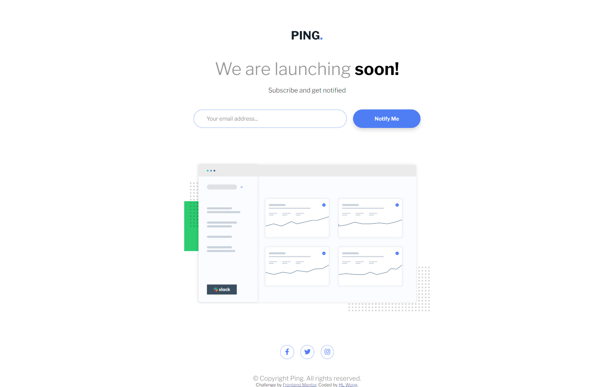
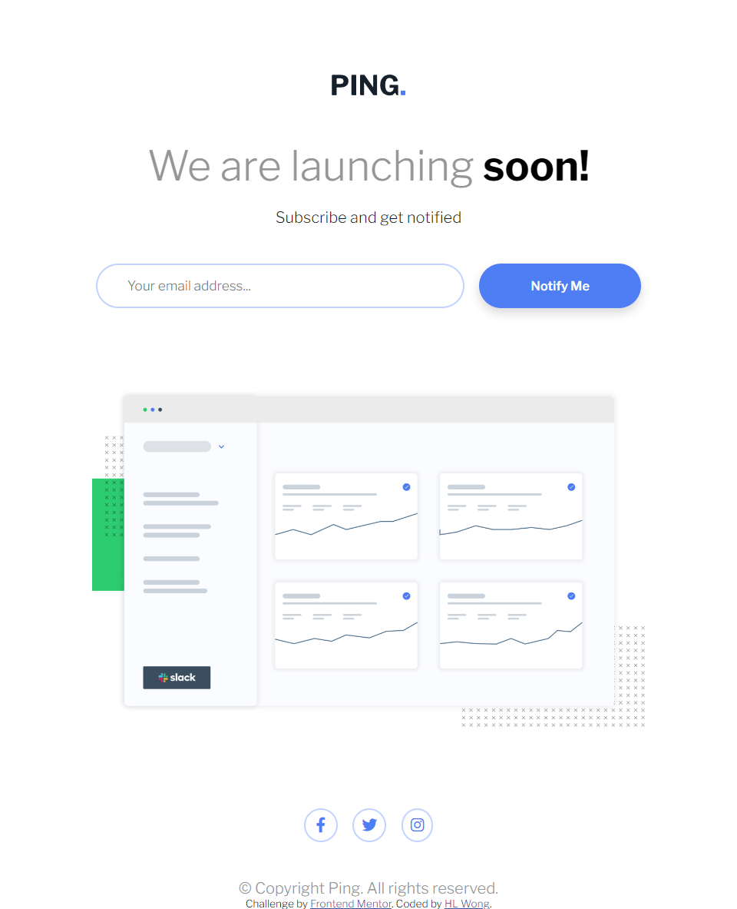
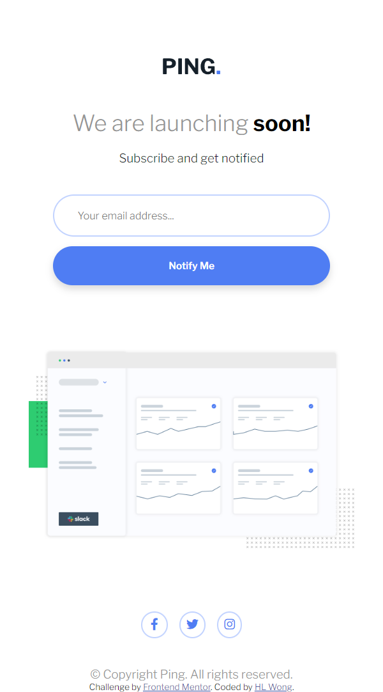

# Frontend Mentor - Ping coming soon page solution

This is a solution to the [Ping coming soon page challenge on Frontend Mentor](https://www.frontendmentor.io/challenges/ping-single-column-coming-soon-page-5cadd051fec04111f7b848da). Frontend Mentor challenges help you improve your coding skills by building realistic projects.

## Table of Contents

- [Overview](#overview)
  - [The challenge](#the-challenge)
  - [Screenshot](#screenshot)
  - [Links](#links)
- [My process](#my-process)
  - [Built with](#built-with)
  - [What I learned](#what-i-learned)
  - [Continued development](#continued-development)
  - [Useful resources](#useful-resources)
- [Author](#author)

## Overview

### The challenge

Users should be able to:

Users should be able to:

- View the optimal layout for the site depending on their device's screen size
- See hover states for all interactive elements on the page
- Submit their email address using an `input` field
- Receive an error message when the `form` is submitted if:
	- The `input` field is empty. The message for this error should say *"Whoops! It looks like you forgot to add your email"*
	- The email address is not formatted correctly (i.e. a correct email address should have this structure: `name@host.tld`). The message for this error should say *"Please provide a valid email address"*

### Screenshot

**Desktop Design**

**Tablet Design**

**Mobile Design**  

### Links

- Solution URL: [Responsive Ping Single Column Coming Soon Page](https://www.frontendmentor.io/solutions/responsive-ping-single-column-coming-soon-page-x-df-KQM-i)
- Live Site URL: [Responsive Ping Single Column Coming Soon Page](https://dwz-wong.github.io/ping-single-column-coming-soon-page/)

## My process

### Built with

- HTML (Hypertext Markup Language)
- CSS (Cascading Style Sheets)
- JavaScript
- FontAwesome

### What I learned

- What I have learned in this project or challenge, I have designed similarly to the design provided using HTML, CSS, and JavaScript to practice and improve my front-end skills. Other than that, I learned email validation and used it on my project or challenge.

### Continued development

- I will keep on challenging Frontend Mentor and other challenges or projects, learn new things, practice more, and improve my front-end skills for future challenges or projects.

### Useful resources

- [Email Validation: Regex & JavaScript](https://www.abstractapi.com/guides/email-validation-regex-javascript) - This link has helped me to understand a bit about email validation regex. Even though I do not fully understand yet, I will keep practicing.

## Author

- freeCodeCamp - [@dwz_wong](https://www.freecodecamp.org/dwz_wong)
- Frontend Mentor - [@dwz-wong](https://www.frontendmentor.io/profile/dwz-wong)
- Twitter - [@dwz_wong](https://twitter.com/dwz_wong)
